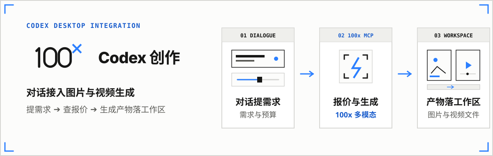
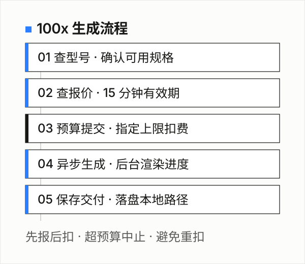
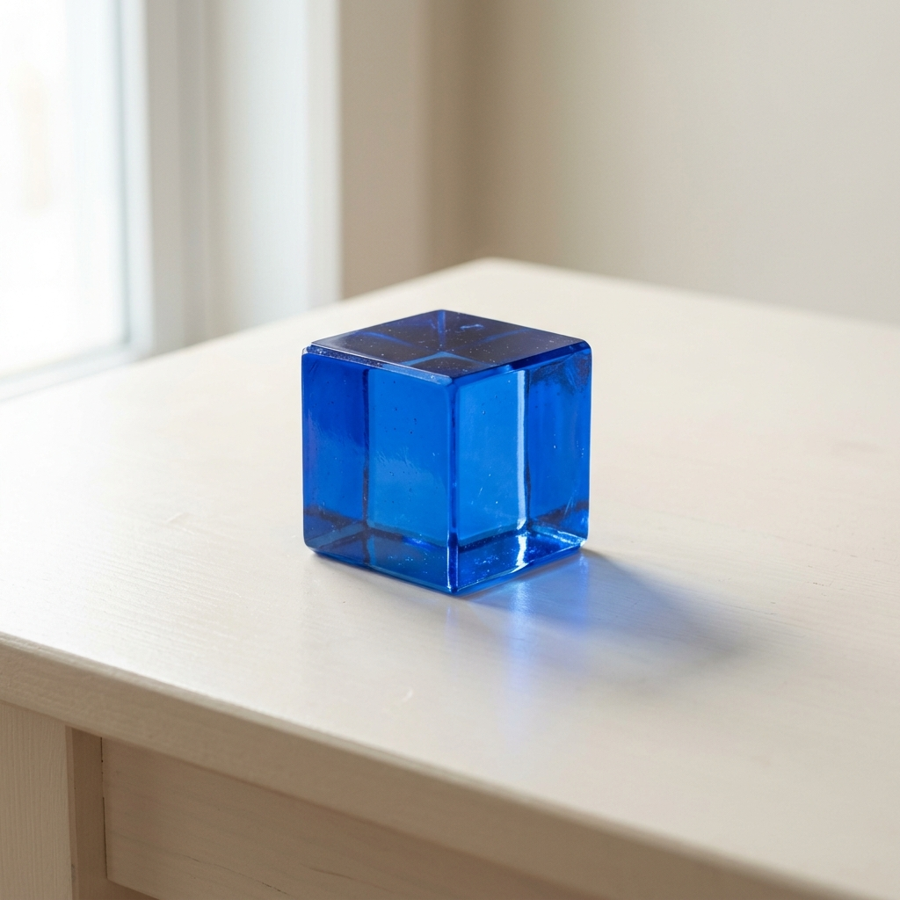

# 100x for Codex Desktop

<p align="center">
  
</p>

让 Codex 对话接入 100x 图片与视频生成。当前为公开客户端，服务接入需使用内测管理员分发的服务地址与令牌（公共服务未开放）。

**版本**：v0.2.0 · **Marketplace**：`100x` · **Plugin**：`100x` · **Skill**：`100x:100x-creative` · **官网**：[100xspeed.app/mcp](https://100xspeed.app/mcp/)

---

## 快速安装

### 推荐：在 Codex 桌面端直接对话安装

在 Codex Desktop 任意任务中发送以下指令：

```text
请阅读 https://github.com/kezd088/100x-mcp/blob/main/INSTALL.md，按说明安装 100x MCP + Skill 到本机 Codex，检查安装结果。不要在对话里索取或显示访问令牌。
```

### 备选：Windows PowerShell 一键安装

在 PowerShell 中运行（终端隐藏输入令牌，通过 Windows DPAPI 本地加密保存）：

```powershell
& ([scriptblock]::Create((irm https://raw.githubusercontent.com/kezd088/100x-mcp/main/install.ps1))) -Connect
```

<details>
<summary>原生 CLI 插件命令与本地开发测试</summary>

```powershell
codex plugin marketplace add kezd088/100x-mcp --json
codex plugin add 100x@100x --json

# 本地开发测试可指定源码目录：
.\install.ps1 -Source "C:\your-folder\100x-mcp" -Connect
```

环境前提：Node.js 22+、Git、Codex CLI 0.155.1+。Windows Codex Desktop 0.155.1 运行时已成功加载 8 个工具与 Skill；系统兼容性与排错详见 [接入指南](./docs/codex-desktop.md)。
</details>

---

## 开始使用

在 Codex 桌面端新建任务，输入 `$100x:100x-creative` 即可开始创作：

### 1. 检查连接状态（不扣积分）

```text
$100x:100x-creative 检查 100x 连接，列出可用型号和余额，不生成。
```

### 2. 带预算上限生成图片（先报价确认）

```text
$100x:100x-creative 先列出当前可用的图片型号。我想生成一张 1K 分辨率的极简科技品牌海报，预算不超过 2 积分，请先告诉我具体报价，确认后再生成。
```

> **素材与产物路径**：参考本地素材时请提供真实绝对路径；生成完毕后，文件直接下载至当前工作目录绝对路径。下载预览受 Codex 宿主媒体权限约束。

---

## 生成流程

<p align="center">
  
</p>

1. **查型号** (`100x_list_models`)：查询当前账户实时可用型号与模式。
2. **查报价** (`100x_quote`)：获取单次准确积分，报价单有效期 15 分钟；价格变动会提示重新报价。
3. **预算提交** (`100x_generate_*`)：指定 `max_credits` 上限提交，超预算自动中止，绑定请求单号防重复计费。
4. **本地交付** (`100x_get_task`)：后台异步渲染完成后，成品自动下载到工作区。

---

## 运行时实测与生成示例

Windows Codex Desktop 0.155.1 运行时实测成功调用 100x 服务，生成 1K 图像示例（消耗 2 积分，请求约 0.52 秒返回任务号；实际桌面点按生成待用户体验）：

<p align="center">
  
  <br>
  <sub>运行时实测生成的 1K 图像样例 · 详见 <a href="./docs/verification.md">验证记录</a></sub>
</p>

---

## 支持模型概览与计费原则

- **Google**：Nano Banana 2 / Pro、Omni
- **OpenAI**：GPT Image 2.5（1K / Flare / Sunburst）
- **xAI**：Grok Image 1.5 / 2、Grok Video 1.5
- **MiniMax**：H3（480P / 1080P）

> 实际可用型号以实时目录为准。积分扣减以提交前 `100x_quote` 即时报价为准，公示页价格为内测基准价。

---

## 相关文档

- [Windows 详细安装、配置、更新与排错指南](./docs/codex-desktop.md)
- [运行时验证记录](./docs/verification.md)
- [100x 官方网站与说明](https://100xspeed.app/mcp/)
